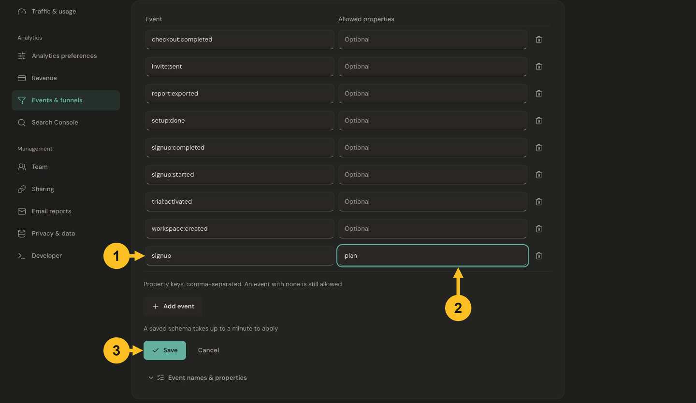
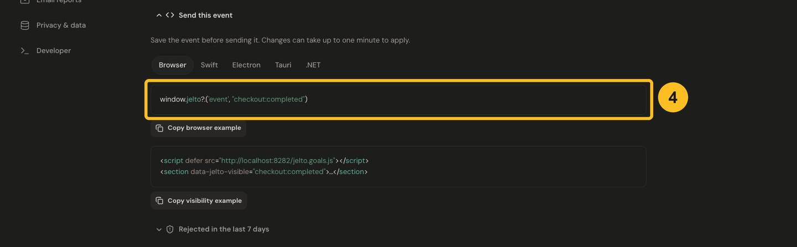

# Create a goal

A goal measures an action you care about, such as creating an account. Choose one precise moment for each event: `signup` should mean an account was created, not merely that someone opened the signup form.

## Before you start

Install [website tracking](../start/website.md) or an [app SDK](../start/apps.md). Have access to edit the product's events and the code that performs the action.

## Register the event

1. Open **Settings → Events & funnels → Events → Add event**.
2. Enter `signup` in **Event**. Names use lowercase letters, digits, `_`, `:`, `.`, or `-`, up to 64 characters.
3. In **Allowed properties**, enter `plan` if you want to distinguish plans. Separate multiple property keys with commas; leave the field empty when none are needed.
4. Choose **Save**. Allow up to one minute for the saved event schema to apply.


[](../images/15-goal-registration.png)

*Register an event name and its allowed property keys, then save. This screenshot shows an unsaved signup example.*

Property keys use lowercase letters, digits and underscores, up to 32 characters. A product supports up to 100 registered events and up to 20 allowed property keys per event. Built-in event names are reserved. Never put an email, name or other personal identifier in an event name or property.

## Send it after the action succeeds

For a website, add this line to the browser success handler that runs **after your server confirms the account was created**. The tracker must already have loaded.

```js
window.jelto?.('event', 'signup', { plan: 'pro' })
```

Optional chaining keeps analytics from breaking signup when a tracker is blocked. It does not queue a call made before the tracker loads. Keep this call in the successful action handler, rather than at module initialization.

Expand **Send this event** to see examples for Browser, Swift, Electron, Tauri and .NET. Match the event name exactly; the screenshot displays an existing demo event.


[](../images/16-goal-code.png)

*Use the example for your platform after the action succeeds. The example shown uses an existing demo event.*

For a button click, use [HTML events](html-events.md). For a browser form submission or section appearing on screen, use [Forms and visibility](forms-and-visibility.md).

## Verify and read the result

Perform the action once. Open the dashboard's Goals card, choose a date range including today, and select the event. Use its property breakdown to compare values such as `pro` and `free`.

Unique converters and total completions answer different questions: one visitor or install can perform an action repeatedly. See [goal details](../guides/explore-goals-and-funnels.md) for interpretation.

If it is missing, open **Rejected in the last 7 days** in Events settings. Check spelling, registration, allowed properties and whether the correct product received it. Follow [Event and funnel troubleshooting](../troubleshooting/events-and-funnels.md).

## Use the goal elsewhere

[Choose it as your KPI](../analytics/kpi.md), filter by its properties, or add it to a [website funnel](../web/funnels.md). Before removing a goal used as the KPI, select a replacement KPI.
