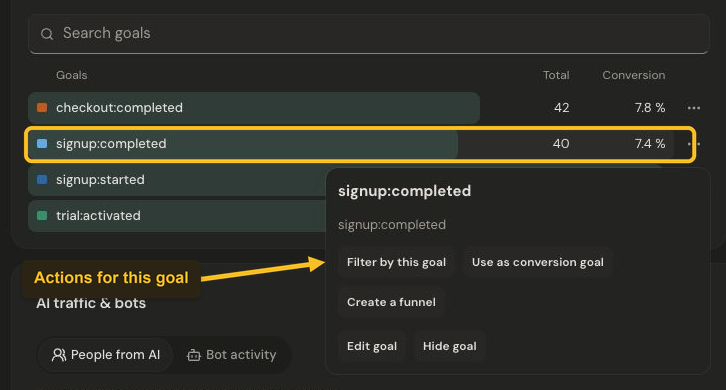
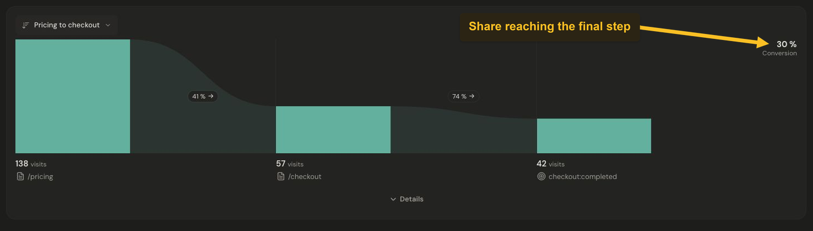

# Explore goals and funnels

Goals show whether an important action happened. Funnels show how visits move through a sequence of website steps. Start with the goals and funnels already configured for your product, or [create a goal](../goals/create-goal.md) and [build a funnel](../web/funnels.md).

## Explore a goal

In **Goals**, choose **Unique visitors** or **Completions**. Select a goal row to focus its trend. Open its **three-dot menu** to see the available actions.

*Open a goal’s three-dot menu to explore its available actions. Select the image to view it at full size.*

**Filter by this goal** focuses the report on the goal. Depending on your access, you can also choose it as the conversion goal, start a funnel draft, or edit its presentation.

Completions count event occurrences, so repeated actions can produce more completions than unique visitors. Use Jelto’s displayed conversion figure instead of dividing rounded numbers yourself.

## Read an existing funnel

Find **Funnels** and choose a definition from the funnel selector. Read its steps from left to right. The step counts show visits that reached each step in order; the percentages between steps show progression to the next step.

*The overall conversion rate is the share of entering visits that reached the final step. Select the image to view it at full size.*

The **Conversion** figure is the share of entering visits that reached the final step. In this example, the path moves from `/pricing` to `/checkout`, then to the observed `checkout:completed` goal.

A website funnel follows steps within a website visit. Automatic payment and subscription goals can use a [verified checkout reference](../payments/browser-attribution.md) to join that visit. Only linked goals can advance the funnel. A checkout-named browser goal remains a tracked action; verified payments and money are reported separately. Website and app identities remain separate.

To create or edit a definition, open **Settings → Events & funnels → Funnels**. See [the funnel setup guide](../web/funnels.md) for the available step types.
