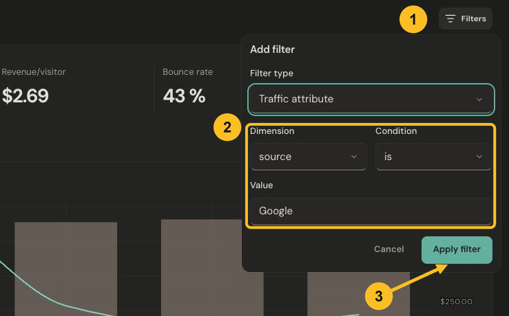
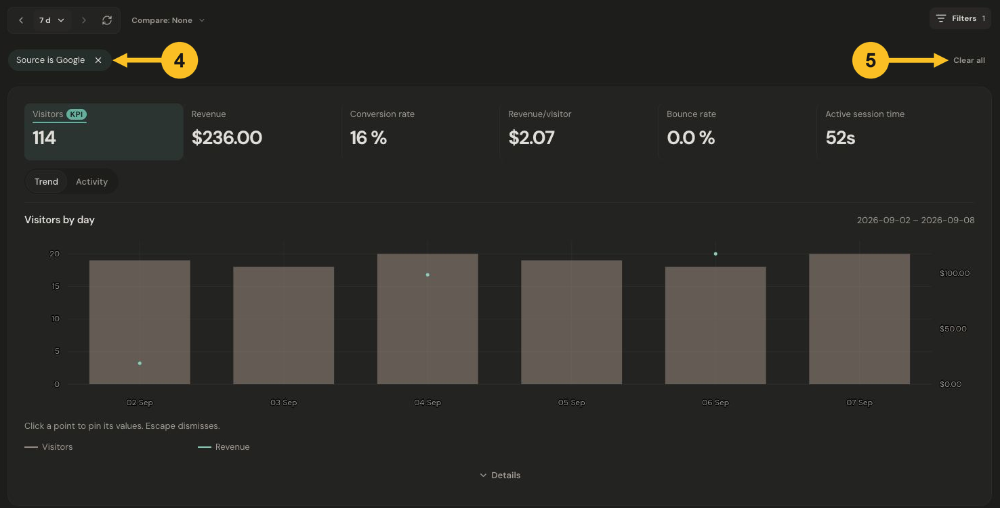

# Filter your data

Filters help you answer a narrower question, such as “What did traffic from Google do?” Start with a date range, then add the condition you want to investigate.

## Add a source filter

1. Select **Filters** beside the date controls.
2. Keep **Traffic attribute**, choose **source** under **Dimension**, leave **Condition** as **is**, and enter **Google** under **Value**.
3. Select **Apply filter**.

*Open Filters, enter Source is Google, and select Apply filter. Select the image to view it at full size.*

## Check the result and reset

4. Check the **Source is Google** chip above the metrics. The report now shows the selected source for the same dates.
5. Select **Clear all** to return to the unfiltered report. To remove just one condition, select the **×** on its chip.

*Check the applied filter above the updated metrics; Clear all restores the full report. Select the image to view it at full size.*

You can also use a row’s filter action in a breakdown card. Check the chips afterward so you always know what the report includes.

## Reuse a useful view

With filters applied, open **Filters** and choose **Save as segment**. A saved segment lets you reuse those conditions without changing your current dates.

For website goals, **Did an event** and **Did not do an event** narrow website sessions by an observed event. Availability depends on the metric and data being queried. An unavailable result does not mean that no activity happened.

Next: [Understand your traffic](understand-your-traffic.md).
