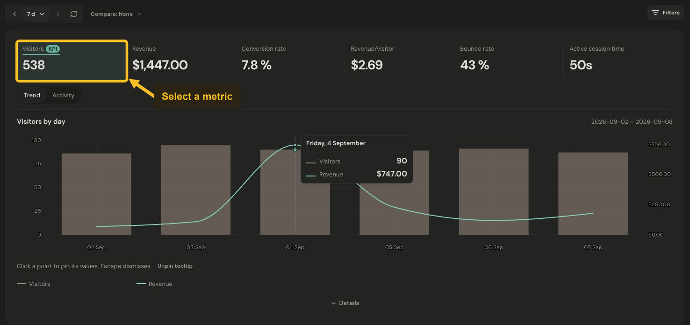
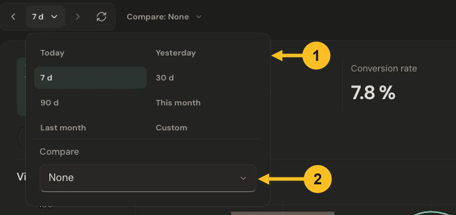

# Read your dashboard

Start with a question: is traffic growing, are more people taking action, or is revenue changing? Your dashboard brings those answers into one view.

Open a product from **Your products**, or use the product selector at the top of a dashboard. The screenshots in these guides use Jelto’s built-in sample data.

## Choose what to explore

Select a metric above the chart to show its trend. **KPI** marks the product’s primary metric. The selected dates and filters apply to the report below.

*Select a metric to show its trend over the chosen dates. Select the image to view it at full size.*

The cards you see depend on whether the product has website activity, app activity, or both. Website visitors and app installs describe different populations.

## Choose dates and compare

1. Open the date button beside the previous-period arrow. Choose a preset, or **Custom** for specific dates.
2. Use **Compare** in the same menu to choose **Previous period** or **Same period last year**. Choose **None** to remove the comparison.

*Choose a date range, then use Compare to add a comparison period. Select the image to view it at full size.*

Use the arrows beside the date button to move between adjacent periods. The date printed above the chart tells you which period you are reading.

## Read a point on the chart

Select a chart point to pin its values. Press **Escape** to dismiss the pinned details. **Activity** opens alternative views of aggregate website activity; **Trend** returns to the chart.

A dash is not automatically zero. Open **Details** where available to understand missing, limited, or unavailable measurements. Visitor counts use the product’s collection mode; in the cookieless example, the same browser can count again on another day.

Next: [Filter your data](filter-your-data.md) or [understand app usage](understand-app-usage.md).
