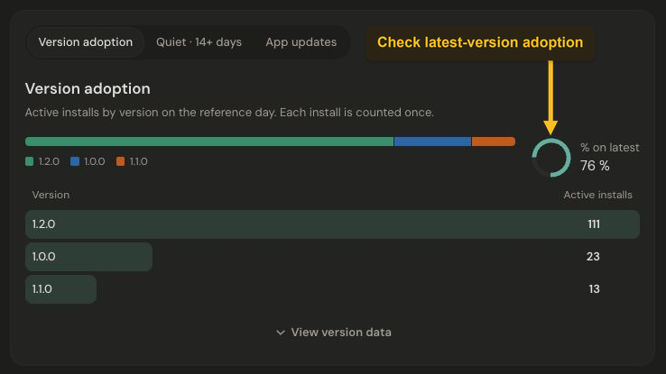

# Understand app usage

For a product with app activity, the dashboard includes app metrics and cards. Use them to understand adoption after installation and whether people keep returning.

## Start with the app metrics

- **Installs** counts install claims received during the period. A reinstall is another install.
- **Active installs** counts distinct installs that sent activity during the selected range.
- **% on latest** shows adoption of the latest configured app version.
- **D7 retention** shows how many eligible installs returned on day seven.

Select an app metric to explore its trend, just as you would a website metric.

## Check version adoption

Find **Version adoption** in the app section. The card groups active installs by their latest reported version on the reference day and shows **% on latest** alongside the distribution.

[](../images/07-app-usage.png)

*Version adoption shows each active install under its latest reported version. Select the image to view it at full size.*

Use **Quiet · 14+ days** to explore installs that have stopped checking in, or **App updates** to inspect reported version changes. **View version data** opens the underlying breakdown.

### Separate upgrades and downgrades

Open **App updates → Version changes** and choose **Upgrades**, **Downgrades**, or **Other changes**. The selected direction applies to the event count, distinct updated installs, daily trend, and To/From version details. **All changes** includes every direction. One install can change version several times, so these two counts can differ.

Direction is calculated for existing history as well as new events. Jelto compares one to four numeric components, with an optional `v` prefix and SemVer prerelease ordering. For example, `1.10.0` follows `1.9.0`, and `2.0.0` follows `2.0.0-rc.1`. Build metadata does not change precedence. Equal-precedence versions, opaque labels such as `Release Blue`, whitespace, and unsupported syntax appear under **Other changes**. The exact source and target labels remain visible.

## Track update activity

The automatic `app_updated` event confirms that a different version launched. To see what happened before that launch, connect your updater callbacks to the existing SDK `track` API and open **App updates → Update activity**. Appcast configuration supplies the published version; it does not observe downloads or installation on users' devices.

Send `app_update` with `from_version`, `to_version`, and one of these `status` values:

| Status | When to send |
| --- | --- |
| `download_started` | Your app starts a download operation; once per operation, not per progress tick |
| `downloaded` | The updater reports that the download is ready |
| `install_started` | Your app hands the downloaded update to the installer |
| `download_failed` | A download operation reports failure |
| `install_failed` | Installation reports failure to the app |
| `failed` | The updater reports an error whose stage is unknown |
| `postponed` | The user explicitly chooses to update later, or the host declines installation |

Versions must be distinct, nonblank strings of at most 32 characters. An optional `reason` is a short category such as `network`, `permission`, or `remind_later`, using lowercase letters, digits, dots, underscores, or hyphens, up to 64 characters. Do not send exception messages, paths, URLs, or personal data.

For Electron, after initializing Jelto in the main process:

```ts
import jelto from '@jelto/electron'

jelto.track('app_update', {
  from_version: '2.0.0',
  to_version: '2.1.0',
  status: 'install_failed',
  reason: 'permission',
})
```

Use the actual current and target versions from your updater. Tauri uses the same properties with `await jelto.track(...)` from `@jelto/tauri`. Swift uses `Jelto.track("app_update", props: [...])`. With the .NET SDK:

```csharp
Jelto.JeltoClient.Track("app_update", new Dictionary<string, object?> {
    ["from_version"] = "2.0.0",
    ["to_version"] = "2.1.0",
    ["status"] = "postponed",
    ["reason"] = "remind_later"
});
```

No custom event registration or new SDK method is needed. Each call records a new observation; SDK delivery retries keep the same event ID and count once. Two real download attempts count twice. The stage selector lets you inspect installation failures or postponements separately, with daily, version, and reason details. These are observed events and distinct installs, not a success rate or a mandatory funnel.

### Connect your updater

- **electron-updater:** Obtain the target from `update-available`. When your app controls downloading, send `download_started` immediately before `downloadUpdate()` and `downloaded` when it resolves. Report a rejected download as `download_failed`. For automatic downloads, send start once on the first `download-progress` callback and completion on `update-downloaded`; cached downloads may have no progress callback. Track `install_started` before `quitAndInstall()`. Route `error` according to the operation in progress, and use one failure-reporting path to avoid counting the same error from both a callback and a rejected promise. Track your own “Later” action as `postponed`; `update-cancelled` alone does not establish that choice. See the [official events and methods](https://www.electron.build/docs/features/auto-update/).
- **Tauri Updater:** After `check()` returns an update, use its `currentVersion` and `version`. Separate `download()` and `install()` calls to distinguish their failures: report start before each call, completion after download resolves, and the appropriate failure in each catch block. If using `downloadAndInstall()`, its download completion callback marks the boundary; a progress tick is not another start. On Windows, successful installer launch exits the app, so code after `install()` may never run. Use your app's explicit “Later” choice for postponement. See the [official updater API](https://v2.tauri.app/reference/javascript/updater/).
- **WinSparkle:** `win_sparkle_set_update_postponed_callback` reports the “remind me later” action. The general error callback does not identify a stage; use `failed` unless your integration knows which operation failed. The general cancelled/dismissed callbacks cover several outcomes and must not all become postponements. `win_sparkle_set_user_run_installer_callback` exposes a downloaded payload and lets your app handle installer launch; retain its documented return behavior. Use your own operation boundary for download start and retain the known target version in your integration. The generic callbacks alone cannot supply every stage or the outcome of an external installer. See the [official callback declarations](https://github.com/vslavik/winsparkle/blob/master/include/winsparkle.h).
- **Velopack:** After `CheckForUpdatesAsync()`, keep the returned target version. Surround `DownloadUpdatesAsync()` with start, completion, and failure observations. Send `install_started` before `ApplyUpdatesAndRestart()` or `ApplyUpdatesAndExit()`, which can exit immediately. Record the user's choice to defer separately; a pending package alone does not prove postponement. An external installation failure must be reported by code that actually receives that outcome. See the [official UpdateManager reference](https://docs.velopack.io/reference/cs/Velopack/UpdateManager).

Delivery remains best effort under the SDK's queue and shutdown rules. Keep update operations working even when telemetry cannot be delivered. If an installer exposes an outcome only on a later launch, your app can persist and report that known outcome then, retaining the original source and target versions. An absent completion or a missing launch is not proof of failure. Past failures cannot be reconstructed from version-change history.

## Configure the published version

**% on latest** compares activity with the published version configured for each app. It does not assume that the highest version observed in incoming events is your current release.

Open **Settings → Overview → Published app version**. This section appears for products with a registered app or an existing version setting. If multiple apps are registered, use the **App** dropdown to choose the macOS, Windows, or Linux app you want to configure. With one app, its name appears without a dropdown. Each app has its own version and update feed. Unsaved version edits stay with their app when you switch selections.

The product-wide percentage combines installs that are on their own app’s published version. Apps without a configured version are excluded. For example, macOS can target `1.5.1` while Windows targets `2.0.0`. Existing product settings are copied to existing apps during migration; newly added apps start without a version.

On the dashboard, products with multiple apps also show an **App** dropdown next to the product name. Choose an app to filter its cards and charts, or **All apps** to return to the combined overview. The selection stays in the URL and preserves your date range, comparison and other filters.

For manual updates, select **Manual**, enter **Latest version**, and save. Use the exact version your SDK reports, such as `2.4.1`; it can contain up to 32 characters. Clear the field to remove the configured version. Switching to Manual disconnects automatic appcast checks.

For automatic updates:

1. Select **Appcast / update feed**.
2. Enter your public HTTPS **Appcast URL** using the release feed for your updater, as listed below.
3. Save. Jelto checks the feed immediately and shows the published version and last check time.

The daily maintenance job checks connected feeds again when their previous check is at least 24 hours old. **Check now** retries a saved feed immediately; save or discard other edits first. If a check fails, the previous published version remains in use and the error appears beside the feed. Correct the URL or feed and retry, or switch to Manual.

### Supported appcast formats

Jelto detects the format from the feed contents. Use the URL of the published metadata file or a complete updater response endpoint:

| Updater | Example Appcast URL | Published version |
| --- | --- | --- |
| [Sparkle](https://sparkle-project.org/documentation/publishing/) / [WinSparkle](https://winsparkle.org/guides/publishing-updates/) | `https://updates.example.com/appcast.xml` | Greatest numeric `sparkle:version` build; displays `sparkle:shortVersionString` when supplied |
| [electron-updater](https://www.electron.build/docs/features/auto-update/) | `https://updates.example.com/latest.yml` | Top-level `version`; `latest-mac.yml` and `latest-linux.yml` also work |
| [Tauri Updater](https://v2.tauri.app/plugin/updater/#server-support) | `https://updates.example.com/latest.json` | Top-level `version` in static or dynamic updater JSON |
| [Velopack](https://docs.velopack.io/distributing/overview) | `https://updates.example.com/releases.win.json` | Greatest stable `Version` among `Assets` whose `Type` is `Full` |

Supply the complete feed URL for your platform and stable channel. For electron-updater and Velopack, a hosting directory or release web page is insufficient. For dynamic Tauri endpoints, replace any `{{target}}`, `{{arch}}`, and `{{current_version}}` placeholders yourself, or use the static JSON feed. A `204 No Content` response retains the previous version and reports no supported release.

**Sparkle and WinSparkle:** Jelto orders numeric dotted builds regardless of item order. Child elements and legacy attributes on `enclosure` are supported. For example, this item configures `2.4.1`, matching the version reported by your SDK:

```xml
<rss version="2.0" xmlns:sparkle="http://www.andymatuschak.org/xml-namespaces/sparkle">
  <channel>
    <title>Example app releases</title>
    <item>
      <sparkle:version>20401</sparkle:version>
      <sparkle:shortVersionString>2.4.1</sparkle:shortVersionString>
      <enclosure url="https://updates.example.com/app-2.4.1.zip"
                 type="application/octet-stream" />
    </item>
  </channel>
</rss>
```

Items with a `sparkle:channel` and delta-only items are excluded. Use numeric builds such as `20401` or `2.4.1`; builds with letter suffixes are unsupported. Equal builds with different displayed versions are rejected.

**electron-updater:** Use the generated YAML release manifest, which contains a version and download entries:

```yaml
version: 2.4.1
files:
  - url: Example-2.4.1.exe
    sha512: <generated checksum>
```

Legacy manifests with a top-level `path` and JSON representations of this metadata also work. A nonempty `files` array takes precedence; when `files` is absent, null, or empty, Jelto uses `path`. `app-update.yml` and `package.json` are configuration files, so use the published `latest*.yml` instead.

**Tauri Updater:** Static JSON must include a `platforms` map with a download URL and signature for every listed target:

```json
{
  "version": "2.4.1",
  "platforms": {
    "windows-x86_64": {
      "url": "https://updates.example.com/Example-2.4.1.exe",
      "signature": "<generated signature>"
    }
  }
}
```

Dynamic responses with top-level `version`, `url`, and `signature` are also supported. The `name` alias can replace `version`; do not send both. A non-null `platforms` map takes precedence over the dynamic fields, and an empty map contains no release. If `platforms` is absent or null, Jelto reads the dynamic response.

**Velopack:** Use `releases.<channel>.json`, such as `releases.win.json`, `releases.osx.json`, or `releases.linux.json`:

```json
{
  "Assets": [
    {
      "PackageId": "Example",
      "Version": "2.4.1",
      "Type": "Full",
      "FileName": "Example-2.4.1-full.nupkg"
    }
  ]
}
```

Jelto compares full release versions numerically, so `2.10.0` follows `2.9.0`. Velopack's [optional fourth revision component](https://docs.velopack.io/reference/cs/Velopack/SemanticVersion) is also supported: `2.4.1.10` follows `2.4.1.9`. The supplied revision is preserved in the published version. Delta packages, installers, and portable archives do not set the published version. Use a feed for one package; conflicting package IDs or equal-precedence versions with different version strings are rejected. The legacy `RELEASES` text file and `assets.<channel>.json` deployment inventory are unsupported.

For electron-updater and Tauri feeds, versions must use full SemVer such as `2.4.1` or `2.4.1+build.7`; Velopack also allows the fourth revision described above. An optional leading `v` is removed; build metadata is preserved. Prerelease versions such as `3.0.0-beta.1` are excluded. The resulting version must fit the 32-character limit and match what your SDK reports. Use Manual if you need a different version string or a prerelease target.

These checks select a stable release across the feed. Operating-system requirements, architecture, and staged rollout rules do not alter the analytics target. The examples above show the metadata Jelto reads; keep the full files generated by your updater, including its checksums and signatures.

The feed must be at most 1 MiB and respond within four seconds. HTTPS redirects are supported up to three hops. URLs must use port 443, be at most 2048 bytes, and contain no credentials or fragment. Local and private network destinations are refused. Jelto reads release metadata; it does not download or install the update archive.

### Configure through the API

Use an [account token](../api/account-tokens.md) with `settings:write` and access to the product. Find the app ID with `GET /api/v1/products/{product}/apps`, then replace the example product ID, app ID and URL. This request previews the change:

```sh
curl --fail-with-body -X PATCH \
  'https://app.jelto.io/api/v1/products/prd_acmedemo01/apps/123/version' \
  -H "Authorization: Bearer $JELTO_TOKEN" \
  -H 'Content-Type: application/json' \
  -d '{"appcast_url":"https://updates.example.com/appcast.xml"}'
```

After reviewing the preview, repeat the identical request with `Jelto-Confirm: true` and a unique `Idempotency-Key` header, as described in the account-token guide. The confirmed response includes `latest_version`, `appcast_url`, `appcast_checked_at`, and `appcast_error`. A feed-check failure is reported in `appcast_error`; the URL is still saved and the previous version is retained.

To set a manual version, send `{"latest_version":"2.4.1"}`; this disconnects appcast. Send `{"latest_version":null}` to clear the version and disconnect. Send only `{"appcast_url":null}` to disconnect while retaining the current version. A manual version and a non-null appcast URL cannot be sent together. Sending the same URL explicitly checks it again.

## Follow onboarding to an outcome

The Onboarding card measures explicitly new install cohorts. Set the SDK's optional
`installOrigin` from saved host state; existing and unknown origins are excluded.
The [existing-app adoption guide](../start/existing-app.md) explains classification
and the effect on historical cohorts. Custom app funnels below count observed entry
events and do not require a new-install claim.

Use an [app funnel](../app/funnels.md) to measure an ordered journey such as `onboarding:welcome → onboarding:complete → upgrade_click`. Open **Settings → Events & funnels → Funnels → Add funnel**, choose **App**, and use the exact onboarding or custom event names your SDK sends.

The report counts installs entering step 1 during the selected dates. Later steps can occur on later days, through the last completed day when you query. Repeated events count once per step, and an event that happens before its preceding step does not advance the journey. Recent cohorts need time to progress; counts below five installs are suppressed.

An onboarding step matches its name regardless of `ok`, `fail` or `skip` status. Use onboarding status metrics when investigating failed or skipped setup steps. An upgrade click is an action; use license or verified payment reporting to assess paid conversion.

## License properties

Report the `license` install property with your desktop SDK’s install-property setter when the license changes.

Accepted license values are strings matching `^[a-z0-9_.-]{1,24}$`, such as `free`, `trial`, `paid` or `expired`; these examples are not a fixed enum. Uppercase letters, spaces and values longer than 24 characters are rejected. `license_share` breaks the live install fleet down by the stored `license` value. `license_conversion` includes only explicitly new install cohorts; existing and unknown origins are excluded. It counts an eligible install as converted only when its latest stored `license` equals the product's `paid_license_value` setting by string equality; the setting defaults to `paid`. If no stored values ever match, an otherwise reportable cohort stays at a true, permanent 0 % even though the query succeeds; align the value in the product settings or through the account API's `paid_license_value` field.

## Put retention in context

The **Retention** card offers **D1**, **D7**, and **D30** for explicitly new install cohorts. Existing and unknown installation origins are excluded. A cohort needs time to reach the day being measured; recent installs may not yet qualify. Treat unavailable retention as unavailable, rather than assuming nobody returned.

**Download to Install** is a period ratio. Downloads and installs counted in the same period can belong to different people, so it is not a person-by-person conversion funnel.

Need to connect an app first? Choose the appropriate [app setup guide](../sdk/swift.md), such as [Electron](../sdk/electron-forge.md) or [Tauri](../sdk/tauri.md).
