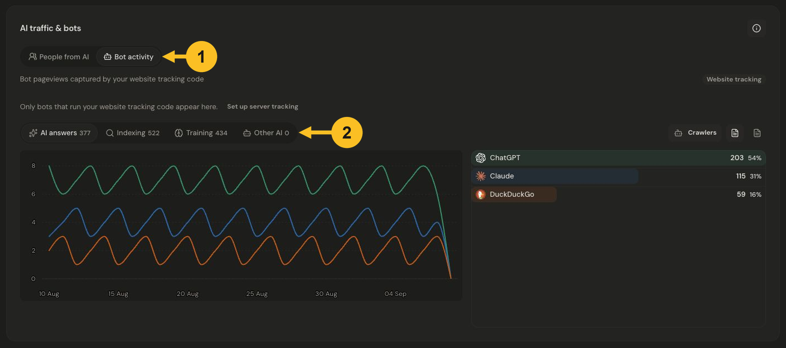
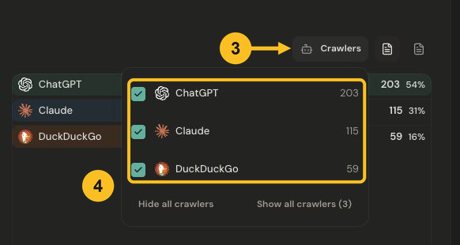

# Understand bot activity

See which bots visit your website, how their activity changes, and what your tracking can actually measure. Start with a product and date range, then find **AI traffic & bots** toward the bottom of the dashboard.

## Separate people from bots

**People from AI** shows human activity after someone follows a link from an AI assistant. **Bot activity** shows automated activity. A visit from ChatGPT and a request by a ChatGPT crawler answer different questions; read them in their respective tabs.

## Choose a bot category

1. Select **Bot activity**.
2. Choose **AI answers**, **Indexing**, **Training**, or **Other AI** to explore that category.

*Choose Bot activity, then select a category to compare its daily activity and crawlers. Select the image to view it at full size.*

- **AI answers** covers bots classified as fetching content for AI answers.
- **Indexing** covers bots classified as building search indexes.
- **Training** covers bots classified as collecting training material.
- **Other AI** covers AI bot activity without a more specific category.

The category badge shows its count for the selected dates. The chart shows activity by day, and the list names the crawlers in that category. In this website-tracking example, the counts are bot pageviews, not unique people or customers.

## Focus on particular crawlers

3. Open **Crawlers** above the chart and list.
4. Select or clear a crawler’s checkbox to show or hide it. **Show all crawlers** restores the full selection; **Hide all crawlers** clears it.

*Open Crawlers and choose which operators appear in the chart and list. Select the image to view it at full size.*

This changes which series and rows you see in this report. It does not block the crawler, delete activity, or add a dashboard filter. Category totals remain the category’s totals when individual crawlers are hidden.

Use the **User agents** control beside Crawlers to expand the identifying strings seen for each row. These are a sample of up to five strings, not a ranking of the most frequent or most recent. Bot names are identified from user-agent information; they are not proof of a verified operator identity.

## Check what is being measured

Look at the tracking label above the report:

- **Website tracking** captures bots that run your website’s tracking code. Bots that never run it will not appear in those counts.
- **Server tracking** records reported bot requests, including requests that do not run the website tracking code.

Browser pageviews and server requests are different measurements. The same activity can appear in both, so adding them together would double-count some activity.

Open **How this is measured**, the information icon in the card header, for the dashboard’s explanation. If you need broader coverage, **Set up server tracking** opens **Settings → Traffic & usage → Server crawlers**. See the [server tracking setup guide](../sdk/crawler.md) when you are ready to connect it.

An empty report can mean that no matching activity was captured for the chosen dates or that tracking is not configured. It does not prove that no bots accessed the website.

Related: [Understand your traffic](understand-your-traffic.md) or [filter your data](filter-your-data.md).
