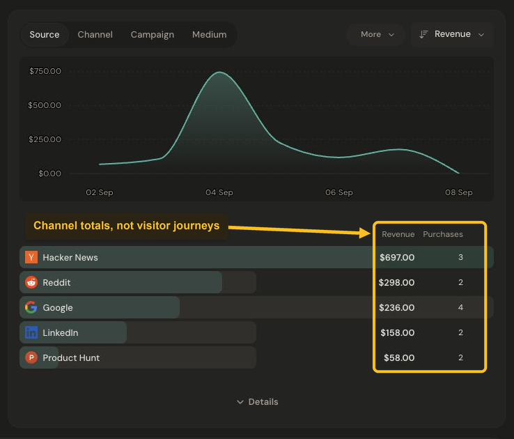

# Understand revenue

Revenue helps you see which channels contribute to the business. Open a product with recorded payments, choose a date range, and check the active filters before comparing results.

## Read revenue by channel

The **Revenue by channel** card combines a revenue trend with a breakdown of revenue and purchase counts. Start with **Source**, or choose another view such as **Channel** or **Campaign**.

*Revenue and purchase counts are grouped by the channel label carried by the checkout. Select the image to view it at full size.*

Each payment is grouped by the channel label its checkout carried. Revenue is attributed to that label; the dashboard does not provide an individual visitor’s purchase history.

## Compare traffic and revenue

Use **Revenue** above the overview chart to focus on revenue over time. The **Sources** card helps you compare traffic and revenue side by side. **Revenue/visitor** is an aggregate average for the selected range, not the amount spent by each visitor.

A high-traffic source is not necessarily the largest revenue source. Look at both revenue and purchase count before drawing a conclusion from one unusually large purchase.

## Understand gaps

A dash can mean that no matching revenue rows exist for a source. Missing attribution is not proof that the traffic produced no value. If revenue appears under Direct unexpectedly, see [why revenue shows Direct](../troubleshooting/all-revenue-shows-direct.md).

Reporting currency and renewal preferences can affect the displayed totals. If historical exchange rates are missing, Jelto keeps that incompleteness visible.

Need to connect payments? Start with the [Stripe](../payments/stripe.md), [Lemon Squeezy](../payments/lemon-squeezy.md), or [Polar](../payments/polar.md) setup guide.
