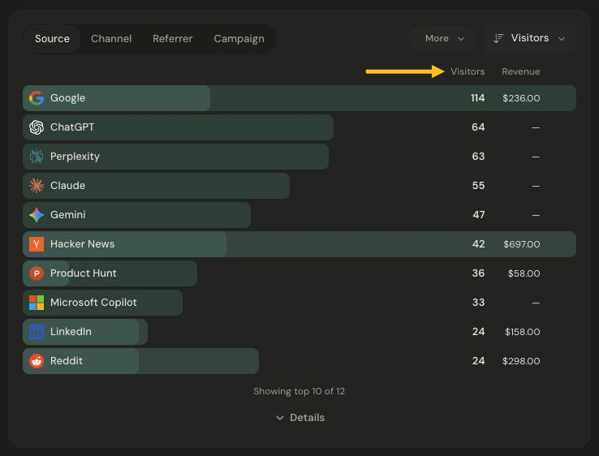
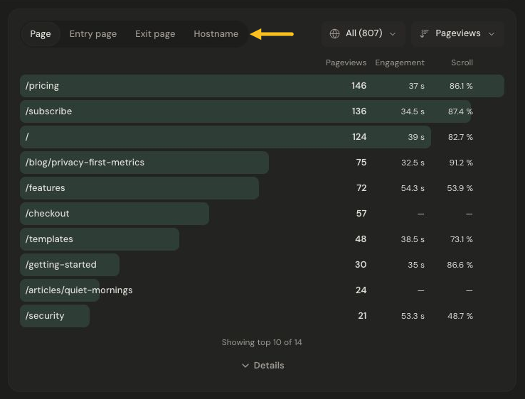

# Understand your traffic

Use Sources and Pages together to understand how people arrive and what they explore. Choose your dates first, and check for any active filter chips.

## Find your strongest sources

The **Sources** card compares where traffic came from. **Source** names the referrer; the other views let you explore channels and campaign information. On a narrower dashboard, these views live in the **Source** menu.

*Compare visitor counts and revenue for each source. Select the image to view it at full size.*

Compare visitor counts with the revenue shown beside them. A source with fewer visitors may still account for more revenue. These are aggregate channel figures; they do not identify individual buyers. A dash can mean there are no matching rows for that metric.

Use a row’s filter action to explore that source across the dashboard, then check the filter chip above the overview.

## Explore pages and entry points

The **Pages** card starts with **Page**, showing pageviews by path. Use the tabs at the top of the card to choose the breakdown you want.

*Use the Pages tabs to switch between paths, entry pages, exit pages, and hostnames. Select the image to view it at full size.*

- **Page** shows which paths received pageviews.
- **Entry page** shows where visits began.
- **Exit page** shows the last page in a visit.
- **Hostname** separates domains when the product has more than one.

Engagement time and scroll depth describe measured pageviews. The coverage note explains how much activity has usable measurements. Entry and exit views describe visits and do not show the same engagement columns.

Next: [Explore goals and funnels](explore-goals-and-funnels.md), or [understand bot activity](understand-bot-activity.md).
