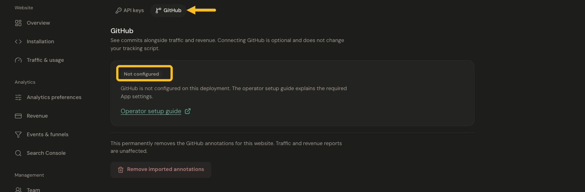

# Connect GitHub commit annotations

GitHub annotations give traffic and revenue changes a release-history context. A commit marker identifies a commit; it does not prove deployment or that the commit caused a metric change.

## Before you start

Have permission to connect integrations for the Jelto product and to authorize the Jelto GitHub App for the intended repository. A private repository can be selected when your installation grants access to it.

## Connect a repository

1. Open **Settings → Developer → GitHub**.
2. Choose **Connect GitHub** and authorize the Jelto GitHub App for the intended account and repository.
3. Back in Jelto, choose the installation/account and repository from the available list, then choose **Connect repository**.
4. Wait for the initial import. Jelto imports recent default-branch commits, including up to 30 days of history, and receives later updates.
5. Open the dashboard chart and inspect commit annotations around a date you recognize.

*Open Developer → GitHub to connect an account and select repositories when the integration is available.*

If the page says **Not configured**, contact the Jelto team to enable the connection before continuing.

## Interpret and manage annotations

Look for a known default-branch commit before comparing it with a traffic change. A feature-branch commit may not appear until it reaches the default branch. Consider campaigns, seasonality and other changes before attributing an effect to a commit.

Use the synchronization action to refresh, or reconnect if the installation is suspended or repository access was removed. Use the GitHub management link to review your authorized repository access.

Disconnecting stops future imports while retaining existing annotations. **Remove imported annotations** is a separate deletion action; read its confirmation carefully. Traffic and revenue data are separate.

If the repository is absent, check the selected GitHub account, organization approval and whether the App installation includes that repository.
