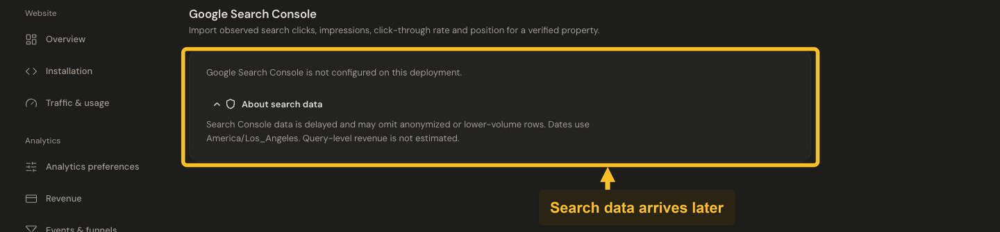

# Connect Google Search Console

Connect Google Search Console to see search queries and pages beside your website analytics. Jelto requests read-only access to search performance.

## Before you start

Use an Owner or Member account in Jelto and a Google account authorized for the Search Console property. Register the matching website hostname in Jelto first.

## Connect the property

1. Open **Settings → Search Console**.
2. Choose the Google connection action and authorize the read-only Search Console permission.
3. Return to Jelto. When exactly one authorized property matches your registered hosts, it is selected automatically. Otherwise choose the intended property and connect it.
4. Wait for the first synchronization, then open **Google search** in the dashboard. Use **Details** for the available query/page list and sync information.

*Search Console reports delayed search data for a verified property. This sandbox has no Google connection.*

If the page says the integration is not configured, contact the Jelto team to enable the connection before authorizing your Google account.

## Read the results

Clicks, impressions, CTR and average position are Google observations. Dates use Google's `America/Los_Angeles` reporting timezone, which can differ from the product timezone. Recent data can be delayed, and Google can omit low-volume or anonymized rows. Visible query rows do not necessarily sum to the property total.

Google-source revenue is measured separately by Jelto. It is not revenue attributed to an individual search keyword, and Jelto does not estimate keyword revenue from click shares.

## Change or repair a connection

Use the property-selection controls to select another eligible property. Use **Sync** for another synchronization, or reconnect if authorization has expired. Disconnect removes the connection credentials and its imported Search Console aggregates. Check the consequences before confirming.

If a property is missing, check the selected Google account's access and the registered Jelto host. For a connected property with no observations, review freshness and date coverage before reconnecting repeatedly.

See [Google's Search Analytics documentation](https://developers.google.com/webmaster-tools/v1/searchanalytics/query) for provider coverage.
