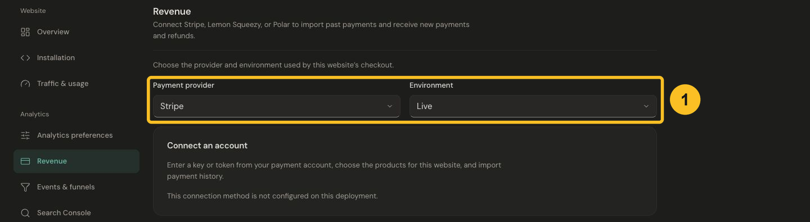
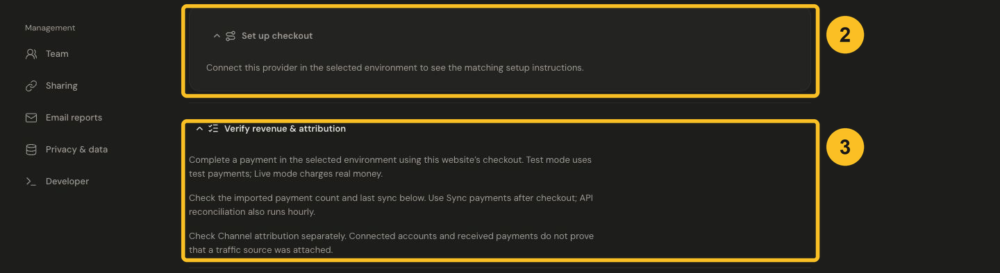

# Connect revenue

Use Revenue to see payments and refunds alongside your website analytics. There are two parts: connecting the provider imports money; checkout attribution connects that money to an aggregate marketing channel.

## Choose your provider

| Provider | Connection | Guide |
| --- | --- | --- |
| Stripe | Restricted API key and selected merchant/products | [Connect Stripe](stripe.md) |
| Lemon Squeezy | API key and selected store/products | [Connect Lemon Squeezy](lemon-squeezy.md) |
| Polar | Organization token and selected products | [Connect Polar](polar.md) |
| Paddle or a custom provider | Your server forwards verified payments with a scoped key | [Paddle and Payments API](paddle.md) |

## Connect an account

1. Open **Settings → Revenue** and choose **Payment provider**.
2. Select **Test** to verify with the provider's test environment, or **Live** for real payments. Keep the account, checkout and helper in the same environment.
3. Follow the provider guide to create the required credential. Paste it only into the connection field; it never belongs in your website code.
4. Select the correct merchant/store/organization and product scope. An empty product selection includes all products in that selected account scope.
5. Review history import and its start date, then connect. If you previously sent these transactions through the Payments API, choose a cutover that avoids counting them twice.

*Choose the payment provider and environment. The example accurately shows an unavailable connection method.*

If this connection method is not configured, contact the Jelto team. Creating additional provider keys will not enable a connection that is unavailable in the dashboard.

## Add checkout attribution

After connection, expand **Set up checkout** and select the method your site uses. API-created checkout needs a browser-to-server metadata handoff. Hosted links can use the optional helper. Stripe Payment Element uses PaymentIntent metadata. The Other method offers a limited email fallback for a confirmed purchase.

*Connect the provider to unlock checkout instructions, then verify payment receipt and channel attribution separately.*

Use the matching provider guide and [Browser payment attribution](browser-attribution.md). A connected account or imported history alone does not prove that attribution is working.

## Verify

In a provider test environment, visit your website through a tagged campaign link, complete its test checkout and return to the tracked success page. Use the selected environment's sync action, then check payment count, last sync/live receipt and channel attribution separately. Live checkout charges real money; it is not needed to test the documentation.

Keep amounts and dates from the provider. Historical payments without attribution may remain Unknown. A success-page visit can be a funnel step, but the provider determines whether payment succeeded.

## Read the result

[Understand revenue](../guides/understand-revenue.md) explains the card and channel breakdown. Reporting currency and renewal preferences change presentation; provider amounts remain preserved. For missing labels, use [Revenue shows Direct](../troubleshooting/all-revenue-shows-direct.md).
