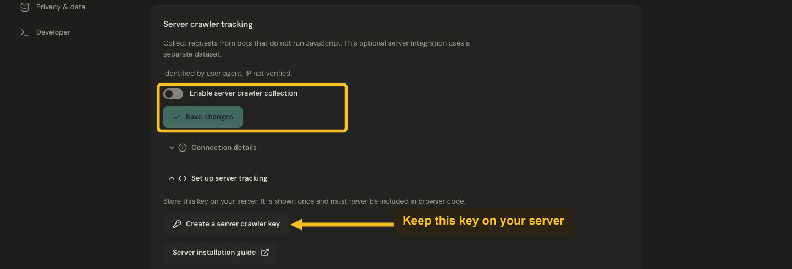

# Set up server crawler tracking

Add optional server tracking to see bots that do not execute your website JavaScript. Website-detected bots and server crawler requests have different coverage and remain separate from human website analytics.

## Prepare the connection

1. Register your public website hostname in Jelto.
2. Open **Settings → Traffic & usage → Server crawler tracking → Set up server tracking**.
3. Create a server crawler key with only `crawlers:write`. Copy it into your server's secret environment as `JELTO_CRAWLER_KEY`. It is shown once and must never appear in browser code.
4. Set `JELTO_API_ORIGIN` to the main Jelto API origin shown for your setup. A custom script/tracking subdomain does not expose the authenticated crawler API.


[](../images/24-crawler-setup.png)

*Create a crawlers:write server key, install server tracking, enable collection and verify a real crawler request.*

## Add server middleware

The package is published on npm as `@jelto/crawler`; its source and releases are at [usejelto/crawler](https://github.com/usejelto/crawler). Install it in your own server project:

```sh
npm install @jelto/crawler
```

Node.js 22 or a Fetch-compatible runtime with Web Crypto and `AbortSignal.timeout` is required. Initialize one tracker in a server-only module:

```ts
import { createCrawlerTracker } from '@jelto/crawler'

const crawlers = createCrawlerTracker({
  endpoint: process.env.JELTO_API_ORIGIN ?? '',
  apiKey: process.env.JELTO_CRAWLER_KEY ?? '',
  publicOrigin: 'https://example.com',
})
```

After your server has produced its response, call:

```ts
crawlers.trackResponse(request, response)
```

Here `request` and `response` are the actual Fetch Request and Response for the page. In middleware without the final response, use `trackRequest(request)` instead. On a short-lived runtime, pass its context with `waitUntil` as the third argument to `trackResponse`. In Node, call `await crawlers.flush()` during your existing graceful-shutdown flow.

Do not convert arbitrary client headers into a trusted public hostname; configure `publicOrigin` from your known website origin.

## Check, enable and verify

Run this once from your server:

```ts
const evidence = await crawlers.check('example.com')
console.log(evidence)
```

The hostname must match your registered public host. A successful check validates the connection but creates no crawler traffic. Then enable **Enable server crawler collection** and save in Traffic & usage.

Deploy the middleware and wait for real eligible crawler requests. Refresh **Connection details**, then read the server source in [Bot activity](../guides/understand-bot-activity.md). Do not label a synthetic user-agent test as evidence of a real Googlebot visit.

## Coverage and reliability

Only eligible GET/HEAD requests are reported. The tracker filters obvious assets and unrelated API routes; robots, llms text, sitemaps, Markdown and PDF resources can be included. It reads URL, method, user-agent and optional response status, not cookies, authorization, bodies, forwarding headers or IP addresses. Query strings and fragments are removed. User-agent classification is a claim, not identity verification.

A return value from `trackResponse` only indicates acceptance into the local queue. Flush is best effort; shutdown, queue limits or exhausted retries can lose observations. Do not use this analytics stream as a complete access log.

Crawler usage has its own allowance and billing behavior; see [Crawler usage](../payments/bot-billing.md). To stop collection, disable it and remove the middleware. Manage any data deletion through Privacy & data or the crawler deletion controls.
