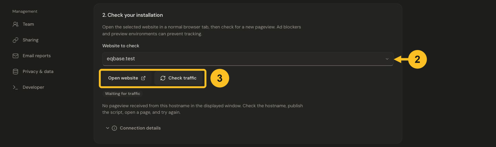

# Verify website tracking

Verify collection using a real visit to the published site. Loading the script file and receiving an event are separate checks.

## Check your installation

1. Publish the script and open **Settings → Installation** in Jelto.
2. Under **2. Check your installation**, select the correct **Website to check**. A visit to `www.example.com` does not verify a different hostname.
3. Choose **Open website** and view a page in a normal browser tab. If your site requires an analytics consent choice, make that choice before testing.
4. Return to Jelto and choose **Check traffic**. Read the reported status and **Connection details**.

*Choose the published hostname, open your website, then check for traffic. This demo is still waiting for a pageview.*

## What success means

A recent pageview from the selected hostname confirms collection for that page. Open a second page through your site's normal navigation and confirm it also appears in the dashboard's Pages card. Choose a date range that includes today and remove filters while checking.

## Still waiting for traffic

- Check the live site's HTML for your product ID and the script URL.
- Confirm the script loads and the collection request is allowed by the site's CSP.
- Try a browser without a blocker affecting the tracking host.
- Register the hostname actually shown in the address bar. Redirects may change it. In guided setup, choose **Add hostname** beside the installation check; existing hostnames are kept, and the new hostname is selected for its own check.
- Localhost, `file:` pages, automation and `?jelto_ignore=1` are excluded by default. Use the explicit [local testing option](../web/configuration.md#local-testing) for localhost; automated visits are not a substitute for this check.

See [No data arriving](../troubleshooting/no-data.md) for a focused checklist.
