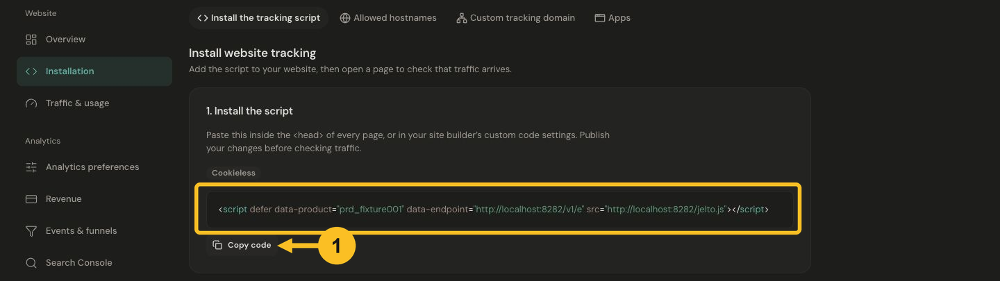

# Install website tracking

Add one Jelto script to your site's shared HTML. It collects pageviews and supported automatic interactions; custom goals are configured separately.

## Before you start

Choose **Add website**, enter your website address, and check its name and reporting timezone. Creating the website registers that hostname and opens a three-step setup: **Add website → Install tracking → Connect revenue (optional)**. Have permission to edit and publish your website.

If your website also has a macOS, Windows or Linux app, enable **This website also has an app**. This adds an optional **Set up SDK** step after website tracking. Your choice is remembered for this product in your browser; products with a registered app include that step automatically. You can also enable it from the installation step later.

You can choose **Finish later** and return through **Finish setup** in the product list. Existing websites can also use **Settings → Installation**, where you can add more allowed hostnames and change tracking preferences.

## Install the script

### Set up with AI

In the **Install tracking** step, **Set up with AI** is selected for you. Check the target hostname
and optionally choose your framework; **Let my assistant detect** lets your
coding assistant inspect the repository. Choose **Copy prompt**, then paste it
into Cursor, Claude Code, Codex or another coding assistant with your project open.

The English prompt includes your public product ID, saved tracking preferences,
complete script, framework guidance and verification checklist. Save preference
changes before copying an updated prompt. **View prompt** shows the full text;
if automatic copying fails, select and copy that text manually.

Review the changes and publish through your normal workflow, then choose **Check my installation** and follow
[Check your installation](verify.md). Copying a prompt or passing a build does
not confirm that Jelto has received traffic.

### Install manually

1. Open the **Install tracking** step, or **Settings → Installation**.
2. Choose **Install manually**, select your platform for matching instructions, then choose **Copy code**.
3. Paste the complete tag inside the shared `<head>` of your site, or into your platform's site-wide custom-code field. Use the [platform guides](../README.md#install) for the exact location.
4. Save and publish the website. A change in an editor preview is not necessarily live.


[](../images/13-installation-code.png)

*Copy the script for this product, paste it into your website, and publish your changes.*

Your copied tag has this shape. All three uppercase values below are placeholders; copy their actual values from your dashboard.

```html
<script defer
  data-product="YOUR_PRODUCT_ID"
  data-endpoint="YOUR_INGEST_ENDPOINT"
  src="YOUR_SCRIPT_URL"></script>
```

The product ID is a public collection identifier. A secret `jk_` API key never belongs in this tag. Keep `data-endpoint` when your copied tag includes it, especially with a custom tracking domain.

## Verify

Open the published website in a normal browser tab, visit a page, then follow [Check your installation](verify.md). Install the script once per HTML document; Jelto handles supported SPA history changes itself.

The first-visit check within **Install tracking** updates automatically and shows the latest received pageview for the selected hostname. Once connected, choose **View dashboard** or **Continue to revenue**. You can also continue while traffic is still waiting; the installation is only marked connected after Jelto receives a pageview.

## Set up an app SDK (optional)

In **Set up SDK**, enter your app's name and platform, then choose **Add app**. Its SDK instructions open after registration. Choose your SDK and use **Copy prompt** with a coding agent, or switch to **Install manually**. See [Connect a desktop app](apps.md) for SDK availability and verification.

Choose **Continue to revenue** when you're ready, or **Skip for now** to leave SDK setup for later. Skipping does not register an app or mark its SDK as installed.

## Connect revenue (optional)

Choose Stripe, Lemon Squeezy or Polar and follow the provider guide to create a key. Review the account and product scope before connecting, then follow **Set up checkout** to link payments to traffic. Payment history and checkout attribution are verified separately.

For Paddle or another provider, choose **Other / Payments API** for the server integration guide. Choose **Skip for now** to open your dashboard without connecting a provider; you can return through **Settings → Revenue** anytime. See [Connect revenue](../payments/connect.md) for details.

## Common problems

If only the homepage appears, move the tag to the shared layout. If nothing arrives, check the hostname, content security policy, blocker extensions and [missing-data guide](../troubleshooting/no-data.md). If counts look doubled, check for [duplicate installations](../troubleshooting/duplicate-pageviews.md).

For optional behavior, use [Script configuration](../web/configuration.md).
