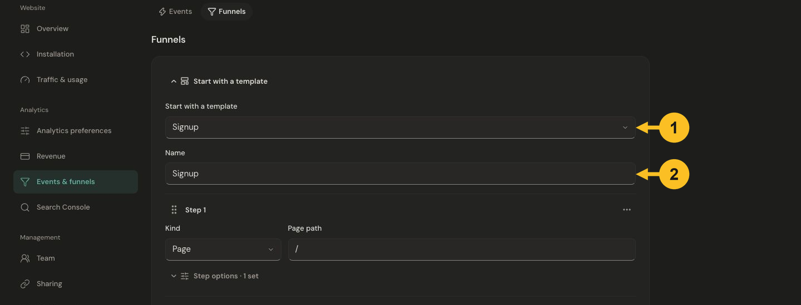
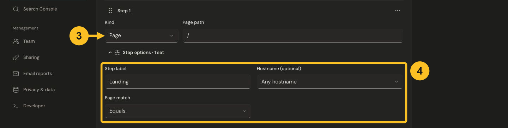
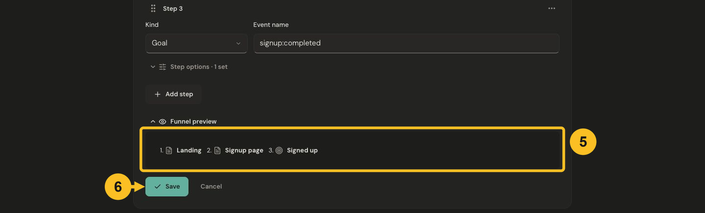

# Create a website funnel

A funnel measures how website visits progress through a sequence, such as opening pricing, starting checkout and reaching a success page. Start with a short journey you can verify yourself.

## Before you start

Install website tracking on the relevant hosts. [Register and send any custom goals](../goals/create-goal.md) used by the journey. Funnel steps use existing page paths and event names; creating a funnel does not start sending those events.

## Choose a starting point

1. Open **Settings → Events & funnels → Funnels → Add funnel**.
2. Expand **Start with a template** and choose **Signup**, **Checkout journey**, **Download journey**, or **Blank funnel**.
3. Give it a recognizable **Name**. Templates are editable starting points: replace their example paths and event names with your own.

*Choose a template and name the funnel before adapting its steps to your website.*

## Define each step

4. Choose **Page** or **Goal** under **Kind**. Enter the **Page path**, such as `/signup`, or the exact **Event name**, such as `signup`.
5. Open **Step options** when needed. **Step label** changes the display name. **Hostname (optional)** restricts the step to one registered host. For pages, **Equals** matches one path; **Starts with** matches a prefix, so `/docs` also matches `/docs/getting-started`.
6. Use **Add step** for additional steps. A funnel has 2–8 steps, and a product can save up to 20 funnels.

*Select Page or Goal, then use Step options to set the label, hostname and path matching rule.*

## Review and save

7. Use the reorder handle or a step's actions menu to arrange the actual journey. For keyboard use, use the available step actions.
8. Open **Funnel preview**, check the ordered labels and choose **Save**.
9. Choose **View funnel results** from the saved funnel and set the reporting dates. Read [funnel results](../guides/explore-goals-and-funnels.md) to interpret completion and drop-off.

*Review the ordered labels before saving. Funnel preview shows the definition, not measured conversions.*

## What the results mean

Steps must occur in order within the same website visit. Extra activity between steps does not by itself complete a step. A visitor returning in a different visit is not a continuation of the original journey. Imported daily totals cannot reconstruct individual ordered visits.

A payment provider record is not automatically a website goal, and an app install is not a browser funnel step. Use a confirmed browser action or success-page visit when appropriate, then check money separately in Revenue. Jelto does not join a website visitor to an app install.

See [two complete examples](../goals/funnel-examples.md) or [troubleshooting](../troubleshooting/events-and-funnels.md).
